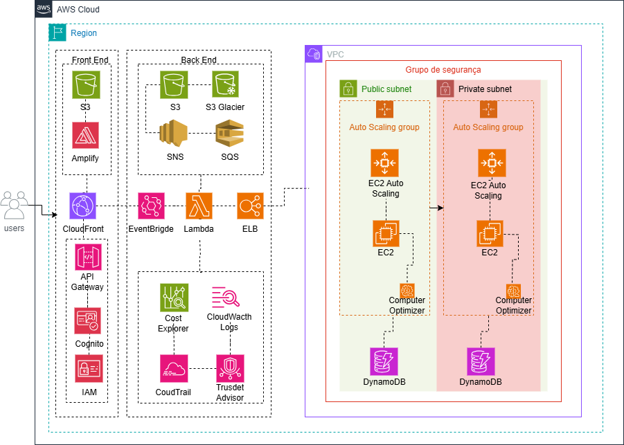

# Arquitetura AWS-Black-friday
O contexto é a implementação de um site e-commerce no período da Black Friday cuja arquitetura garanta alta disponibilidade, escalabilidade automática e processamento por evento.

📖 Descrição do projeto

📊 Diagrama de arquitetura

📌 Tecnologias e serviços usados

🚀 Como funciona o fluxo

📄 Licença e contato

# 🛒 Loja SuperOfertas — AWS Black Friday 🚀

Projeto de arquitetura em nuvem na AWS para suportar alta demanda de acessos e pedidos durante campanhas de Black Friday, utilizando escalabilidade automática, armazenamento inteligente e processamento orientado a eventos.

---

## 📊 Arquitetura da Solução

Diagrama da arquitetura implementada:

> 💡 **Legenda:**  
> ✅ Elastic Load Balancer  
> ✅ Auto Scaling Group com EC2  
> ✅ Amazon S3 com Lifecycle Rules e Event Notifications  
> ✅ AWS Lambda  
> ✅ Amazon EventBridge  
> ✅ Amazon SNS  
> ✅ Amazon SQS  
> ✅ Amazon CloudWatch (Logs & Metrics)  
> ✅ VPC Flow Logs  
> ✅ AWS CloudTrail  
> ✅ AWS Trusted Advisor  
> ✅ DynamoDB  
> ✅ Computer Optimizer  
> ✅ Cost Explorer  
> ✅ Cognito  
> ✅ API Gateway  
> ✅ IAM   
> ✅ CloudFront  
> ✅ Amplify 
 
---

## 📌 Tecnologias e Serviços AWS Utilizados

- **DynamoDB** — Banco de Dados NoSQL.
- **Computer Optimizer** — Otimiza o uso da EC2.
- **Cost Explorer** — Otimização de custos.
- **Cognito** — Serviço de autenticação, autorização e gerenciamento de usuários para suas aplicações web e mobile.
- **API Gateway** — Conexão pela internet.
- **IAM** — Serviço de gerenciamento de identidades e permissões na AWS.
- **CloudFront** — Distribuir conteúdo web, imagens, vídeos, arquivos ou APIs globalmente com baixa latência.
- **Amplify** — Desenvolvimento e hospedagem de aplicações web e mobile full-stack serverless.
- **Elastic Load Balancer** — Distribuição de carga entre instâncias.
- **Auto Scaling Group** — Escalabilidade automática de EC2.
- **Amazon S3** — Armazenamento de arquivos promocionais e pedidos.
- **Lifecycle Rules** — Migração automática de arquivos antigos para Glacier.
- **S3 Event Notifications** — Disparo de eventos ao criar arquivos de pedidos.
- **AWS Lambda** — Processamento sob demanda.
- **Amazon EventBridge** — Orquestração de eventos.
- **Amazon SNS** — Notificações por e-mail/SMS.
- **Amazon SQS** — Fila de mensagens para pedidos.
- **Amazon CloudWatch** — Monitoramento de logs e métricas.
- **VPC Flow Logs** — Análise de tráfego de rede.
- **AWS CloudTrail** — Auditoria de chamadas de API.
- **AWS Trusted Advisor** — Recomendações de segurança, performance e custos.

---

## 🚀 Como Funciona

1. Usuários acessam o site via CloudFront que envia requisições para o Elastic Load Balancer.
2. O ELB distribui requisições para instâncias EC2 em Auto Scaling.
3. Arquivos e imagens promocionais são armazenados no Amazon S3.
4. Ao criar um novo pedido (JSON em um bucket S3), um evento é disparado.
5. O **EventBridge** capta o evento e aciona:
   - **AWS Lambda** para processar o pedido.
   - **Amazon SNS** para notificar o cliente.
   - **Amazon SQS** para enfileirar o pedido para processamento posterior.
6. Logs e métricas são enviados para o **CloudWatch**.
7. Tráfego e APIs são auditados via **VPC Flow Logs** e **CloudTrail**.
8. **Trusted Advisor** gera recomendações de boas práticas.

---

## 📄 Licença

Este projeto está licenciado sob a licença MIT. Consulte o arquivo [LICENSE](LICENSE) para mais detalhes.

---

## 📞 Contato

Andrey Silva  
[🔗 LinkedIn][(https://www.linkedin.com/in/techprofessional-AndreySilva/)]  
✉️ Email: technologyprofessional2023@gmail.com

---

> 💡 Projeto fictício desenvolvido para fins de estudo e demonstração de boas práticas de arquitetura na AWS.

